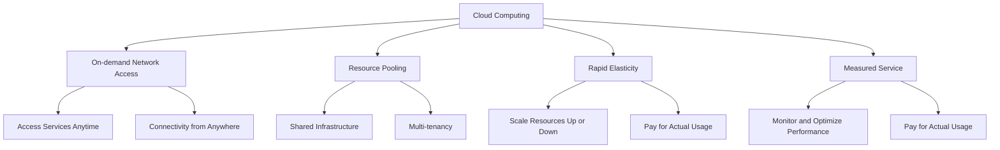

```mermaid
graph TB
A[Cloud Computing] --> B[On-demand Network Access]
A --> C[Resource Pooling]
A --> D[Rapid Elasticity]
A --> E[Measured Service]
B --> F[Access Services Anytime]
B --> G[Connectivity from Anywhere]
C --> H[Shared Infrastructure]
C --> I[Multi-tenancy]
D --> J[Scale Resources Up or Down]
D --> K[Pay for Actual Usage]
E --> L[Monitor and Optimize Performance]
E --> M[Pay for Actual Usage]
```
